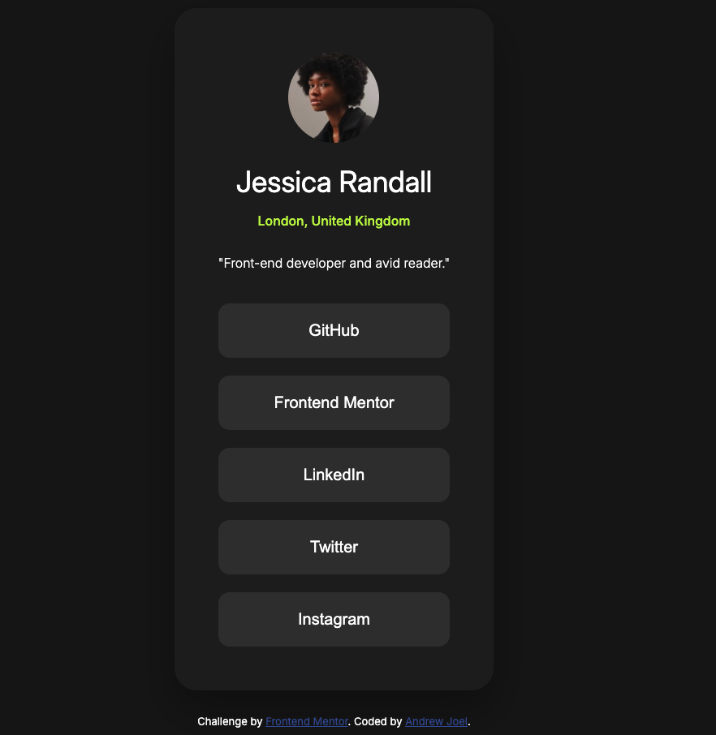
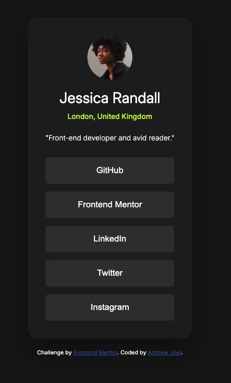

## Table of contents

- [Overview](#overview)
  - [Screenshot](#screenshot)
  - [Links](#links)
- [My process](#my-process)
  - [Built with](#built-with)
  - [What I learned](#what-i-learned)
  - [Continued development](#continued-development)
- [Author](#author)
- [Acknowledgments](#acknowledgments)

## Overview

### Screenshot

Desktop View 

Mobile View 
 

### Links

- Solution URL: [AR_blog-preview-card-main](https://github.com/andrewxrojas/AR_blog-preview-card-main)
- Live Site URL: [Live site](https://andrewxrojas.github.io/AR_blog-preview-card-main/)

## My process

### Built with

- Semantic HTML5 markup
- CSS custom properties

### What I learned

This project served as a crash course for me as I have not used HTML or CSS for a year and I would like to improve my skill set as a designer. I learned from my peers to contain my body of code with a main element after the html element followed by the display: grid; place-items: center; in order to perfectly center the card one the page.

### Continued development

For future projects I would like to continue learning and developing my css and responsive layout design skill set. Eventually I'd want to add Java Script to my arsenal.

## Author

- Website - [Andrew Joel](https://www.andrewxrojas.com)
- Frontend Mentor - [@andrewxrojas](https://www.frontendmentor.io/profile/andrewxrojas)

## Acknowledgments

I'd like to thank Frontend Mentor for providing these type of challenges. These challenges are very helpful and I'm very grateful for these opportunities. 